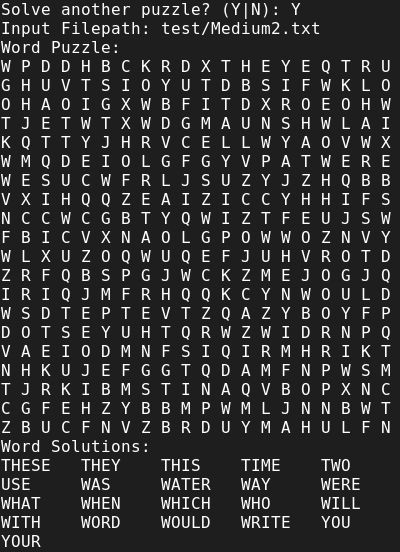
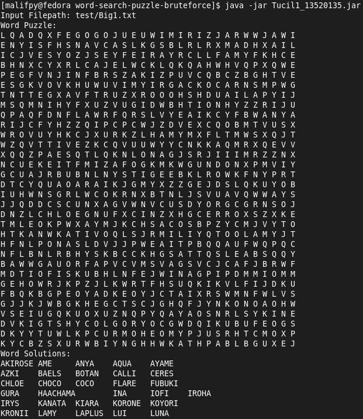

# Laporan Tugas Kecil 1 IF2211 Strategi Algoritma 2021/2022

Oleh Muhammad Alif Putra Yasa, 13520135

## Deskripsi Algoritma

Program ini dapat dibagi menjadi dua bagian, memparse puzzle, dan menyelesaikan puzzle. Oleh karena itu, kedua bagian akan dibahas secara terpisah.

### Mem-*parse* Puzzle

#### Langkah 1

Baca seluruh file dan simpan dalam sebuah variabel bertipe `String`. Jika ada kesalahan di file, atau file tidak ada, *raise error*.

#### Langkah 2

Split file yang telah disimpan di variabel bertipe `String` dengan `'\n\n'` (*double enter*). Langkah ini akan memisahkan variabel tersebut menjadi dua bagian, bagian pertama yang berisi puzzle dan bagian kedua yang berisi daftar kata-kata.

#### Langkah 3

Dari bagian pertama hasil **Langkah 2**, lakukan dua split lagi menggunakan `'\n'` (*enter*) lalu dengan `' '` (*space*). Langkah ini akan menghasilkan array bertipe `String` dua dimensi. Puzzle yang terlah di-*parse* ini kemudian disimpan di atribut `puzzle_matrix`.

#### Langkah 4

Dari bagian kedua hasil **Langkah 2**, split lagi dengan `'\n'`. Langkah ini akan menghasilkan array of String. Daftar kata-kata yang telah di-*parse* ini kemudian disimpan di variabel `puzzle_solutions`.

#### Langkah 5

Gunakan Puzzle yang telah di-*parse* di **Langkah 3** untuk menentukan dimensi puzzle, lalu menyimpannya di atribut `puzzle_rows` dan `puzzle_cols`. Puzzle kini telah selesai di-*parse* dan siap untuk di-*solve*.

### Menyelesaikan Puzzle

#### Langkah 1

Siapkan array `String` dua dimensi yang berukuran sama dengan Puzzle yang ingin di-*solve*. Di langkah selanjutnya, array ini akan dipanggil `solvedPuzzle`. Isi seluruh sel `solvedPuzzle` dengan `-`. Kemudian siapkan variabel bertipe `Integer` untuk menyimpan jumlah pembandingan huruf. Di langkah selanjtnya, variabel ini akan dipanggil `compNumber`.

#### Langkah 2

Lakukan iterasi untuk tiap sel di puzzle. Setiap iterasi, panggil fungsi `cellCompare`. Fungsi ini akan mengisi `solvedPuzzle` dengan kata ditemukan sesuai dengan arahnya dan menambah jumlah `compNumber`. Detail mengenai `cellCompare` akan dibahas di langkah selanjutnya.

#### Langkah 3

Di `cellCompare`, akan dilakukan iterasi terhadap daftar kata-kata. Untuk setiap kata-kata, akan dipanggil fungsi `directionCompare`, yang akan melakukan perbandingan kata dari daftar kata-kata (selanjutnya akan disebut dengan *keyword*) dan *keyword* yang di-*reverse* (selanjutnya akan disebut dengan *reversed keyword*) dengan kata yang dimulai atau diakhiri di sel tersebut (selanjutnya akan disebut dengan *puzzleword*) berdasarkan empat arah, **KANAN**, **BAWAH**, **KANAN-BAWAH**, dan **KIRI-BAWAH**. Fungsi ini juga menghasilkan jumlah perbandingan yang telah dilakukan. Detail fungsi `directionCompare` akan dibahas di langkah selanjutnya.

#### Langkah 4

Di `directionCompare`, akan diukur panjang *keyword*. Berdasarkan arahnya, akan diambil `String` sepanjang *keyword*. Jika tidak cukup, akan diambil sebanyak mungkin. Kemudian, *puzzleword* ini akan dibandingkan dengan *keyword* dan *reversed keyword* menggunakan konstruktor *class* `StringCompare`. *Class* `StringCompare` berisi jumlah perbandingan dan hasil pembandingan kedua `String`. Pemanggilan konstruktor ini akan tetap dilakukan meski kedua kata tidak memiliki panjang yang sama. Detail mengenai *class* ini akan dibahas di langkah selanjutnya.

#### Langkah 5

Di `StringCompare`, akan diukur panjang kedua kata. Jika tidak sama, akan langsung menghasilkan `false`. Jika sama, akan dilakukan perbandingan perhuruf sampai selesai (kata sama) atau ada huruf yang berbeda. Jumlah perbandingan huruf disimpan di atribut `compNum` dan hasil perbandingan disimpan di atribut `compResult`. Hasil ini akan digunakan di fungsi `directionCompare`.

#### Langkah 6

Di `directionCompare`, hasil perbandingan *puzzleword* dengan *keyword* dan *reversed keyword* akan digunakan untuk mengisi *solvedPuzzle*. Jumlah perbandingan yang dilakukan akan dijumlahkan dengan pembandingan dengan arah lain, lalu jumlah ini akan di-*return* ke fungsi `cellCompare`.

#### Langkah 7

Di `cellCompare`, hasil dari `directionalCompare` akan dijumlahkan dengan `directionalCompare` menggunakan *keyword* lain. Jumlah dari seluruh hasil `directionalCompare` di sel tersebut akan di-*return* ke fungsi utama (**Langkah 2**).

#### Langkah 8

Kemudian akan dijumlahkan hasil `cellCompare` untuk seluruh sel yang ada di `puzzle_matrix`. Puzzle kini telah selesai, puzzle yang telah selesai dapat di-*display* menggunakan metode `display` beserta dengan jumlah pembandingan huruf yang telah dihitung sebelumnya.

## Source Program

Bahasa Pemrograman yang digunakan untuk proyek ini adalah Java. Program terbagi menjadi tiga file, `Word_Puzzle.java`, `Puzzle_Solver.java`, dan `Main.java`.

### `Word_Puzzle.java`

```java
import java.io.IOException;
import java.nio.file.Files;
import java.nio.file.Path;

public class Word_Puzzle {
    public Integer puzzle_rows;
    public Integer puzzle_cols;
    public String[][] puzzle_matrix;
    public String[] puzzle_solutions;

    public Word_Puzzle(Integer puzzleRows, Integer puzzleCols) {
        puzzle_cols = puzzleCols;
        puzzle_rows = puzzleRows;
        puzzle_matrix = new String[puzzleRows][puzzleCols];
        puzzle_solutions = null;

        for (int rows = 0; rows < puzzleRows; rows++) {
            for (int cols = 0; cols < puzzleCols; cols++) {
                puzzle_matrix[rows][cols] = "-";
            }
        }
    }

    public Word_Puzzle(String filepath) {
        try {
            String main_file[] = Files.readString(Path.of(filepath)).split("\\n\\n");
            puzzle_matrix = parsePuzzleMatrix(main_file[0]);
            puzzle_solutions = parsePuzzleSolutions(main_file[1]);
            puzzle_rows = puzzle_matrix.length;
            puzzle_cols = puzzle_matrix[0].length;
        } catch (IOException e) {
            System.out.printf("ERROR when reading %s\n", filepath);
            System.exit(0);
        }
    }

    private static String[][] parsePuzzleMatrix(String puzzleMatrixString) {
        String tempPuzzleMatrix[] = puzzleMatrixString.split("\\n");
        String[][] puzzleMatrix = new String[tempPuzzleMatrix.length][tempPuzzleMatrix[0].split(" ").length];

        for (int row = 0; row < tempPuzzleMatrix.length; row++) {
            puzzleMatrix[row] = tempPuzzleMatrix[row].split(" ");
        }
        return puzzleMatrix;
    }

    private static String[] parsePuzzleSolutions(String puzzleSolutionsString) {
        return puzzleSolutionsString.split("\\n");
    }

    public void display() {
        System.out.println("Word Puzzle: ");
        for (int i = 0; i < puzzle_rows; i++) {
            for (int j = 0; j < puzzle_cols; j++) {
                System.out.printf("%s ", puzzle_matrix[i][j]);
            }
            System.out.println("");
        }

        System.out.println("Word Solutions: ");
        // for (int solNum = 0; solNum < puzzle_solutions.length; solNum++) {
        //     System.out.println(puzzle_solutions[solNum]);
        // }
        int printIdx = 0;
        while (printIdx < puzzle_solutions.length) {
            do {
                System.out.printf("%s\t", puzzle_solutions[printIdx]);
                printIdx++;
            } while (printIdx % 5 != 0 && printIdx < puzzle_solutions.length);
            System.out.println();
        }
    }
}
```

### `Puzzle_Solver.java`

```java
import java.util.Objects;

public class Puzzle_Solver {

    public String[][] solvedPuzzle;
    public Integer compNumber;

    public Puzzle_Solver(Word_Puzzle WP) {
        compNumber = 0;
        solvedPuzzle = emptyPuzzle(WP.puzzle_rows, WP.puzzle_cols);
        for (int rowIdx = 0; rowIdx < WP.puzzle_rows; rowIdx++) {
            for (int colIdx = 0; colIdx < WP.puzzle_cols; colIdx++) {
                compNumber += cellCompare(WP, solvedPuzzle, rowIdx, colIdx);
            }
        }

    }

    private static String[][] emptyPuzzle(Integer rowNum, Integer colNum) {
        String[][] resultPuzzle = new String[rowNum][colNum];
        for (int rowIdx = 0; rowIdx < rowNum; rowIdx++) {
            for (int colIdx = 0; colIdx < colNum; colIdx++) {
                resultPuzzle[rowIdx][colIdx] = "-";
            }
        }
        return resultPuzzle;

    }

    private static Integer min(Integer intA, Integer intB) {
        return Math.min(intA, intB);
    }

    private static Integer min(Integer intA, Integer intB, Integer intC) {
        return Math.min(intA, Math.min(intB, intC));
    }

    private static String reverseString(String str) {
        String rString = "";
        for (int idx = 0; idx < str.length(); idx++) {
            rString = str.charAt(idx) + rString;
        }
        return rString;
    }

    private static String getHorizontalString(Word_Puzzle WP, Integer initX, Integer initY, Integer charNum) {
        String res = "";
        for (int charIdxOffset = 0; charIdxOffset < min(charNum, WP.puzzle_cols - initX); charIdxOffset++) {
            res += WP.puzzle_matrix[initY][initX + charIdxOffset];
        }
        return res;
    }

    private static String getVerticalString(Word_Puzzle WP, Integer initX, Integer initY, Integer charNum) {
        String res = "";
        for (int charIdxOffset = 0; charIdxOffset < min(charNum, WP.puzzle_rows - initY); charIdxOffset++) {
            res += WP.puzzle_matrix[initY + charIdxOffset][initX];
        }
        return res;
    }

    private static String getNegativeDiagonalString(Word_Puzzle WP, Integer initX, Integer initY, Integer charNum) {
        String res = "";
        for (int charIdxOffset = 0; charIdxOffset < min(charNum, WP.puzzle_rows - initY,
                WP.puzzle_cols - initX); charIdxOffset++) {
            res += WP.puzzle_matrix[initY + charIdxOffset][initX + charIdxOffset];
        }
        return res;
    }

    private static String getPositiveDiagonalString(Word_Puzzle WP, Integer initX, Integer initY, Integer charNum) {
        String res = "";
        for (int charIdxOffset = 0; charIdxOffset < min(charNum, WP.puzzle_rows - initY,
                initX); charIdxOffset++) {
            res += WP.puzzle_matrix[initY + charIdxOffset][initX - charIdxOffset];
        }
        return res;
    }

    private static StringCompare horizontalCompare(Word_Puzzle WP, Integer initRow, Integer initCol, String toCompare,
            String[][] resultPuzzle) {
        String str = getHorizontalString(WP, initCol, initRow, toCompare.length());

        StringCompare normalComp = new StringCompare(str, toCompare);
        StringCompare reverseComp = new StringCompare(str, reverseString(toCompare));

        StringCompare compareResult = new StringCompare(normalComp.compNum + reverseComp.compNum,
                normalComp.compResult || reverseComp.compResult);

        if (compareResult.compResult) {
            for (int idxOffset = 0; idxOffset < toCompare.length(); idxOffset++) {
                resultPuzzle[initRow][initCol + idxOffset] = WP.puzzle_matrix[initRow][initCol + idxOffset];
            }
        }

        return compareResult;
    }

    private static StringCompare verticalCompare(Word_Puzzle WP, Integer initRow, Integer initCol, String toCompare,
            String[][] resultPuzzle) {
        String str = getVerticalString(WP, initCol, initRow, toCompare.length());

        StringCompare normalComp = new StringCompare(str, toCompare);
        StringCompare reverseComp = new StringCompare(str, reverseString(toCompare));

        StringCompare compareResult = new StringCompare(normalComp.compNum + reverseComp.compNum,
                normalComp.compResult || reverseComp.compResult);

        if (compareResult.compResult) {
            for (int idxOffset = 0; idxOffset < toCompare.length(); idxOffset++) {
                resultPuzzle[initRow + idxOffset][initCol] = WP.puzzle_matrix[initRow + idxOffset][initCol];
            }
        }

        return compareResult;
    }

    private static StringCompare negativeDiagonalCompare(Word_Puzzle WP, Integer initRow, Integer initCol,
            String toCompare,
            String[][] resultPuzzle) {
        String str = getNegativeDiagonalString(WP, initCol, initRow, toCompare.length());

        StringCompare normalComp = new StringCompare(str, toCompare);
        StringCompare reverseComp = new StringCompare(str, reverseString(toCompare));

        StringCompare compareResult = new StringCompare(normalComp.compNum + reverseComp.compNum,
                normalComp.compResult || reverseComp.compResult);

        if (compareResult.compResult) {
            for (int idxOffset = 0; idxOffset < toCompare.length(); idxOffset++) {
                resultPuzzle[initRow + idxOffset][initCol + idxOffset] = WP.puzzle_matrix[initRow + idxOffset][initCol
                        + idxOffset];
            }
        }

        return compareResult;
    }

    private static StringCompare positiveDiagonalCompare(Word_Puzzle WP, Integer initRow, Integer initCol,
            String toCompare,
            String[][] resultPuzzle) {
        String str = getPositiveDiagonalString(WP, initCol, initRow, toCompare.length());

        StringCompare normalComp = new StringCompare(str, toCompare);
        StringCompare reverseComp = new StringCompare(str, reverseString(toCompare));

        StringCompare compareResult = new StringCompare(normalComp.compNum + reverseComp.compNum,
                normalComp.compResult || reverseComp.compResult);

        if (compareResult.compResult) {
            for (int idxOffset = 0; idxOffset < toCompare.length(); idxOffset++) {
                resultPuzzle[initRow + idxOffset][initCol - idxOffset] = WP.puzzle_matrix[initRow + idxOffset][initCol
                        - idxOffset];
            }
        }

        return compareResult;
    }

    private static Integer cellCompare(Word_Puzzle originalWP, String[][] resultPuzzle, Integer rowIdx,
            Integer colIdx) {
        Integer compNumber = 0;
        for (int keywordIdx = 0; keywordIdx < originalWP.puzzle_solutions.length; keywordIdx++) {
            String keyword = originalWP.puzzle_solutions[keywordIdx];
            compNumber += horizontalCompare(originalWP, rowIdx, colIdx, keyword, resultPuzzle).compNum;
            compNumber += verticalCompare(originalWP, rowIdx, colIdx, keyword, resultPuzzle).compNum;
            compNumber += negativeDiagonalCompare(originalWP, rowIdx, colIdx, keyword, resultPuzzle).compNum;
            compNumber += positiveDiagonalCompare(originalWP, rowIdx, colIdx, keyword, resultPuzzle).compNum;
        }

        return compNumber;
    }

    public void display() {
        System.out.println("Solved Puzzle: ");
        for (int rowNum = 0; rowNum < solvedPuzzle.length; rowNum++) {
            for (int colNum = 0; colNum < solvedPuzzle[0].length; colNum++) {
                System.out.printf("%s ", solvedPuzzle[rowNum][colNum]);
            }
            System.out.println("");
        }

        System.out.printf("Total Character Comparison: %d Comparison(s)\n", compNumber);
    }

}

class StringCompare {
    public Integer compNum;
    public Boolean compResult;

    public StringCompare(String strA, String strB) {
        compNum = 0;
        compResult = Objects.equals(strA.length(), strB.length());
        Integer compMax = Math.min(strA.length(), strB.length());
        while (compResult && compNum < compMax) {
            compResult = Objects.equals(strA.charAt(compNum), strB.charAt(compNum));
            compNum++;
        }
    }

    public StringCompare(Integer comparisonNum, Boolean comparisonResult) {
        compNum = comparisonNum;
        compResult = comparisonResult;
    }
}
```

### `Main.java`

```java
import java.util.Objects;
import java.util.Scanner;

public class Main {
    public static void main(String[] args) {

        Scanner consoleInput = new Scanner(System.in);

        String filePath;
        String queryAnswer;
        Boolean repeat;

        do {

            System.out.printf("Input Filepath: ");
            filePath = consoleInput.nextLine();

            // Load File
            Word_Puzzle wp = new Word_Puzzle(filePath);

            // Display Puzzle Info to Console
            wp.display();
            System.out.println();
            System.out.printf("Solving %d x %d Word Puzzle...\n", wp.puzzle_rows, wp.puzzle_cols);

            // Timer Start
            long startTime = System.nanoTime();

            // Solve Puzzle
            Puzzle_Solver solvedPuzzle = new Puzzle_Solver(wp);

            // Timer Ends
            long endTime = System.nanoTime();

            // Display Result
            float duration = (endTime - startTime) / 1000000;
            System.out.printf("Solved in %.2f ms\n", duration);
            solvedPuzzle.display();

            do {
                System.out.printf("Solve another puzzle? (Y|N): ");
                queryAnswer = consoleInput.nextLine();
            } while (!Objects.equals(queryAnswer, "Y") && !Objects.equals(queryAnswer, "N"));

            repeat = Objects.equals(queryAnswer, "Y");
        } while (repeat);

        System.out.println("Thank You! Exiting Program...");
        consoleInput.close();
    }
}
```

## Tests

### Test Case 1 (Small Puzzle)

File: `test/Small1.txt`


\ 

### Test Case 2 (Small Puzzle)

File: `test/Small2.txt`

**Input**


\ 

**Output**


\ 

### Test Case 3 (Small Puzzle)

File: `test/Small3.txt`

**Input**


\ 

**Output**


\ 

### Test Case 4 (Medium Puzzle)

File: `test/Medium1.txt`

**Input**


\ 

**Output**


\ 

### Test Case 5 (Medium Puzzle)

File: `test/Medium2.txt`

**Input**


\ 

**Output**


\ 

### Test Case 6 (Medium Puzzle)

File: `test/Medium3.txt`

**Input**


\ 

**Output**


\ 

### Test Case 7 (Big Puzzle)

File: `test/Big1.txt`

**Input**


\ 

**Output**


\ 

### Test Case 8 (Big Puzzle)

File: `test/Big2.txt`

**Input**


\ 

**Output**


\ 

## Links and Check Lists

#### GitHub Link [https://github.com/malifpy/word-search-puzzle-bruteforce](https://github.com/malifpy/word-search-puzzle-bruteforce)

| Poin | Ya | Tidak |
| ---- |:--:|:-----:|
| Program berhasil dikompilasi tanpa kesalahan (*no syntax error*)  | X | |
| Program berhasil *running*                                        | X | |
| Program dapat membaca file masukan dan menuliskan luaran.         | X | |
| Program berhasil menemukan semua kata di dalam puzzle.            | X | |